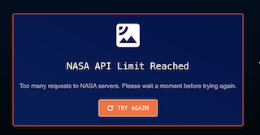
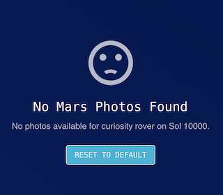

## NASA Data Explorer - Demo App

### Getting Started

Clone this repo, and set up a .env file:

```
VITE_NASA_API_KEY=your_nasa_api_key_here
VITE_NASA_BASE_URL=https://api.nasa.gov

# Get a free API key at: https://api.nasa.gov
# For testing, you can use DEMO_KEY
```

Then run:

```
npm i
npm start
```

1. Click 'START EXPLORING' - View table with filters and pagination. Check different error and empty data states.
2. Click on a photo or View icon to activate the modal component. 
3. Click on 'Return to Dashboard'. Click on PLAN MISSION. Use the form to submit a mission plan.

### Description of Approach and Design Decisions

My Science Museum of Minnesota background and the educational potential of NASA's API inspired the design of this demo app: an educational tool for middle school Physical Sciences classrooms. My goal was to create an interface that captivates kids and adults alike, offers intuitive navigation, and sparks curiosity about research.

### Tech Stack

- React 19 with TypeScript
- Material-UI (MUI) v7+ custom theme (I've used Vuetify before, so feels familiar)
- Axios
- TanStack Query (React Query) for server state management – NEW
- Form Management: React Hook Form with Yup validation – NEW
- Build Tool: Vite

### Assumptions

- I envisioned this demo app to be used in a middle school science classroom.
- Users (students and teachers) are tablet/desktop savvy.
- NASA APIs are available, responsive, and do not require authentication for demo purposes.
- The classroom has internet access.
- The UI is designed for desktop and modern tablet browsers, but still looks and feels good on mobile.

### Testing Error States and Empty Data States

Testing Different Error/No Data States:

### 403

Comment out the real VITE_NASA_API_KEY.
Uncomment the VITE_NASA_API_KEY=INVALID_KEY_FOR_TESTING

You see the NASA Data Error message.


### 404

Corrupt the endpoint (lines 51-57) by uncommenting out the broken endpoint, and commenting out the real endpoint.
You see the NASA Data Error message.


### 429

Change the VITE_NASA_API_KEY value to: DEMO_KEY
Refresh the page multiple times; Change filters rapidly (rover, sol day, camera) - After ~30 requests, you should hit the limit!



### Empty Data State

Put in 10,000 for the Sol filter.
You should see the empty data state with a message.



### Testing

This project includes Cypress end-to-end testing with TypeScript configuration:

```bash
# Open Cypress Test Runner (interactive)
npm run cypress:open

# Run tests in headless mode
npm run cypress:run

```

**To run tests:**

1. Start the development server: `npm start`
2. In another terminal, run: `npm run cypress:open`
3. Click on test files to run them

**To run tests:**

1. Start the development server: `npm start`
2. In another terminal, run: `npm run cypress:open`
3. Click on `homepage.cy.ts` to run the HomePage tests

**Current test coverage:**

- ✅ HomePage renders correctly
- ✅ Main components are visible
- ✅ Falling stars animation works
- ✅ Responsive design on mobile/tablet/desktop
- ✅ Mission planning modal interaction
- ✅ Start Exploring button functionality
- ✅ Basic accessibility checks

### Improvements for Future Iterations

- Color palette and UI flow should be improved with the help of a designer
- CSS should be better organized; right now I'm using a 'Tailwind CSS' approach, using MUI sx prop for inline styling but this wouldn't scale well
- Possibly use Routing to create separate pages
- Send Mission plans somewhere to be printed, etc.
- Unit Test Suite should be added to test modular function logic
- Integration Tests should be added to test API features
