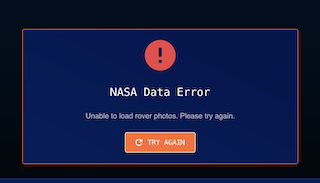

## NASA Data Explorer - Demo App

### Setup and Installation

For a fast preview, click this link: https://trial-app-git-main-ciciwoolfs-projects.vercel.app

Otherwise, clone this repo and run:

```
npm i
npm start
```

### Description of Approach and Design Decisions

For this demo, I designed the app with the vision of it being used in a Grade 8 Physical Sciences classroom. My goal was to create an interface that is visually engaging, easy to navigate, and accessible for both students and teachers. By leveraging live data from NASA APIs, the app aims to make space science interactive and relevant, supporting classroom learning with real-world data and fostering curiosity about science and technology.

### Overview Technologies, Familiar and New

- React 19 with TypeScript
- Material-UI (MUI) v5 (I've used Vuetify with Vue, so feels similar)
- Styling: MUI's styled system + custom theme
- React Context + useReducer (or Redux Toolkit) – NEW
- Axios
- React Query/TanStack Query – NEW
- Routing: React Router v6
- Form Management: React Hook Form with Yup validation - NEW
- Testing: Jest
- React Testing Library - NEW
- Build Tool: Vite

### Assumptions
- I envisioned this demo app to be used in a Grade 8 Physical Sciences classroom.
- Users (students and teachers) know how to navigate the web.
- NASA APIs are available, responsive, and do not require authentication for demo purposes.
- The classroom has internet access.
- The UI is designed for desktop and modern tablet browsers, but you can access the table on mobile.

### Improvements for Future Iterations
- Color palette should be improved with help of a designer
- CSS better organized; right now there's some inline styling for quicker development
- Add more functionality to the Data Table
- Use routing to create a page for the Data Table

### Testing Error States and Empty Data States

Testing Different Error/No Data States:

403
Comment out the real VITE_NASA_API_KEY.
Uncomment the VITE_NASA_API_KEY=INVALID_KEY_FOR_TESTING

You see the Nasa Data Error message.


404
Corrupt the endpoint (lines 51-57) by uncommenting out the broken endpoint, and commenting out the real endpoint.
You see the Nasa Data Error message.


429 
Change the VITE_NASA_API_KEY value to: DEMO_KEY
Refresh the page multiple times; Change filters rapidly (rover, sol day, camera) - After ~30 requests, you should hit the limit!


No Data State:
Put in 10,000 for the Sol filter. 
You should see the empty data state with a message.
